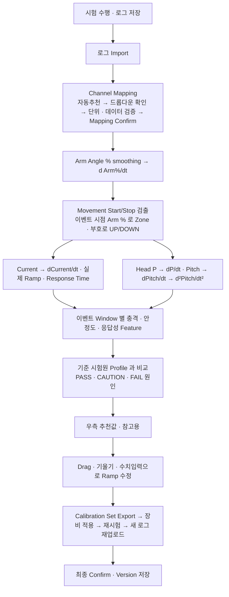

# 휠로더 암 감성 기반 Current Ramp Calibration 지원 프로그램 — 프로젝트 기획서

| 항목 | 내용 |
|---|---|
| 리포 | data09-09 |
| 제출자 | 이영우 |
| 직무·소속 | 휠로더 시험 담당 (데이터 취득, 파라미터 튜닝 및 데이터 분석, 성능 개발) |
| 과정 | 현장 데이터 디지털화 전문가과정 1차수 |
| 작성일 | 2026-09-28 |
| 문서 상태 | 초안 v0.3 — 2026-09-29 수강생 추가 요청(허용 범위·차트 커서·설정 설명) 반영 |

> v0.2 는 수강생이 2026-09-28 에 다시 올린 **보안 해제본 개발 기획서**와 확인 사항 답변 댓글을 바탕으로 다시 썼습니다. 기획서는 같은 날 두 번 올라왔고, **09:30 판(`docs/source/03_Current_Ramp_Calibration_개발기획서_ChannelMapping_0930.docx`, 이하 「제출 기획서」)을 정본**으로 삼았습니다. 08:34 판(`02_…_0834.docx`)과의 차이는 4.3 Channel Mapping 절과 완료 기준 AC-13~19 추가이며, 3.2절에 반영했습니다. 용어·화면·신호·판정 상태·단계는 제출 기획서를 따릅니다. v0.1 은 첨부가 DRM 암호화되어 게시물 본문만으로 썼던 초안이며, 그 경위는 부록에 남겼습니다.

---

## 1. 추진 배경과 현안

제출자가 적은 현안은 두 가지입니다.

1. **감성 기준의 불일치** — 파라미터 튜닝 시 장비마다 시험자별로 느끼는 감성(작업장치/조향의 속도, 충격, 응답성 등의 프로파일)이 달라, 같은 시리즈인데도 모델별로 일관된 컨셉을 유지하기 어렵습니다.
2. **반복 입력의 비효율** — 파라미터 값을 일일이 입력하고 작동해 보는 방식을 반복해야 해서 업무 효율이 떨어집니다.

제출 기획서는 배경을 이렇게 더 좁혀 적었습니다.

- 암 조작성은 압력·속도만으로 평가하기 어렵고, 베테랑 시험원이 느끼는 「탁 걸림」「쏠림」「부드러움」「반응이 답답함」 같은 감성 판단이 Calibration 에 중요합니다.
- 이 감성 판단이 개인 경험에 머물러 있어, 기준 인원의 암묵지를 데이터와 연결해 재사용할 수 있게 보존해야 합니다.
- Current Ramp 를 지나치게 느리게 하면 충격은 줄지만 응답성이 나빠집니다. 그래서 목표는 **「충격 최소화」가 아니라 「감성 허용범위 안에서 가장 좋은 응답성」** 입니다.

## 2. 목표

### 최종 목표

휠로더 암의 UP/DOWN 조작 감성을 정량화하고, 암 높이 4개 Zone 별 Start/Stop(End) Current Ramp 파라미터를 시험원이 직접 조정·검증하도록 돕는 **Offline Calibration Tool** 을 만듭니다. 제출 기획서의 구현 철학대로 **감성을 AI 로 대체하는 도구가 아니라, 감성을 데이터화해 사람이 더 빠르고 일관되게 Calibration 하게 하는 도구**입니다.

### 범위 원칙 (제출 기획서에서 확정)

- **시험 종료 후 저장한 로그를 올려 분석**하는 방식으로 고정합니다. 실시간 장비 연결·실시간 CAN 수집·ECU Parameter Write 는 범위에서 제외합니다.
- 추천값은 **우측 참고 패널에만** 보여 주고, 사용자가 「추천값 적용」을 누르기 전에는 Ramp 값을 바꾸지 않습니다. 최종 결정은 시험원이 합니다.
- 「오프라인」은 **인터넷이 없는 PC에서 동작**하고, **장비 컨트롤러와 연결하지 않는 분석 전용**이라는 두 뜻을 모두 만족해야 합니다(댓글 답변 8).

### 1차 개발 목표

- 4 Zone × UP/DOWN × Start/Stop = **16개 Ramp 파라미터**를 한 화면에서 보고, 그래프 드래그·기울기(%/sec) 입력·파라미터 직접 입력 세 방식으로 고치되 서로 즉시 맞춰지게 합니다.
- 로그를 올리면 Arm Angle Percent 에서 **Movement Start/Stop 이벤트를 검출**하고, 이벤트 순간의 Arm Angle % 로 Zone 을 정하며, 이벤트 창(Window)에서 충격·안정도·응답성 Feature 를 계산합니다.
- 기준 시험원 Profile(허용 범위)과 비교해 **PASS / CAUTION / FAIL 원인**을 표시합니다.
- Calibration Set 을 버전으로 저장·비교·복원·내보내기합니다.

## 3. 보유 데이터

| 데이터 | 형태 | 규모·주기 | 비고(민감도 등) |
|---|---|---|---|
| 시험 로깅데이터 | CSV (제출 기획서는 CAN/CSV/MDF 로그를 언급) | 샘플링 10 ms(100 Hz). 현재 샘플 1건 보유(댓글 답변 2) — 제출 기획서 4.3 의 `sample data.csv`: 6,599행, 채널 8개, 0.00~65.98 s, Δt 중앙값 10.00 ms | 헤더 8개는 3.2절. 파일 자체는 아직 받지 않았습니다 |
| 기준·타 시험인원 로그 구분 | CSV | 미확인 | 제출 게시물의 「기준 시험인원 및 타 시험인원 로깅데이터」 |
| 허용감성 점수 라벨 | **아직 준비되지 않음** | — | 「임의로 생성 필요, 임의 파일로 프로그램 동작 여부만 확인 예정」(댓글 답변 6). 형식은 제출 기획서 9장 저장 항목을 따릅니다 |
| Current Ramp 파라미터 사양 | 미확인 | 16개 | 이름·단위·Min/Max·Step·ECU 값과 %/sec 의 관계는 제출 기획서 13장에서도 「착수 전 확정 필요」 |
| 제출 기획서 | docx (보안 해제본) 2판 | 09:30 판 약 2.7만 자, 표 24개, 그림 1 | 정본 `docs/source/03_…_ChannelMapping_0930.docx`, 이전판 `02_…_0834.docx`, 그림 1 은 `docs/source/02_그림1_메인UI_스케치.jpg` |

### 3.1 입력 신호 (제출 기획서 4장)

| 신호 | 필수도 | 사용 목적 |
|---|---|---|
| Time / Timestamp | 필수 | 공통 시간축, Sampling 검증, 모든 미분·응답시간 계산 |
| Arm Angle Percent | 필수 | Zone 판정 + 프로그램이 만든 d(Arm%)/dt 로 Movement Start/Stop 및 UP/DOWN 검출 |
| Current Command | 필수(택1) | Start/Stop Current Ramp, Current onset/decay, dCurrent/dt. Actual Coil Current 와 둘 중 최소 1개 필수 |
| Actual Coil Current | 필수(택1), 권장 | 실제 밸브 구동 Current, Command 대비 추종성 |
| Arm Cylinder Head Pressure | 필수 | 원신호. 프로그램이 dP/dt, Peak, ΔP 생성 |
| Pitch Angle | 필수 | 원신호. 프로그램이 dPitch/dt, d²Pitch/dt², ΔPitch 생성 |
| Joystick Position / Direction | 선택 | 있을 때만 방향 검증용 보조신호 |
| Engine RPM · Hydraulic Oil Temperature · Payload | 권장 | 시험조건 기록·보정 |
| Ride Control State · Rod Pressure | 선택 | 개입 여부 분리, 실린더 Force 해석 |

미분 신호(dP/dt, dPitch/dt, d²Pitch/dt², d(Arm%)/dt, dCurrent/dt)는 **입력으로 받지 않고 프로그램이 원신호에서 만듭니다.** 원본 로그는 고치지 않습니다.

### 3.2 Channel Mapping (제출 기획서 4.3, 09:30 판에서 추가)

CSV 를 불러온 직후, 분석 전에 **표준 신호와 실제 CSV 헤더를 연결**하는 화면을 둡니다. 자동추천은 후보일 뿐이고, 사용자가 드롭다운 선택과 신호 의미·단위를 확인한 뒤 **Mapping Confirm** 을 해야 분석을 시작할 수 있습니다.

| 표준 신호 | 필수 여부 | `sample data.csv` 의 추천 헤더(제출 기획서 예시) | 단위·상태 |
|---|---|---|---|
| Time / Timestamp | 필수 | `Time[s]` | s 확인 |
| Arm Angle Percent | 필수 | `LASP::FFD3_BoomAnglePercentage` | 0~100% 의미 확인 |
| Current — UP | 필수 택1 (UP 분석) | `LOGE_::EPPR_ArmUp[mA]` | mA, Command/Actual 종류 확인 |
| Current — DOWN | 필수 택1 (DOWN 분석) | `LOGE_::EPPR_ArmDown[mA]` | mA, Command/Actual 종류 확인 |
| Arm Cylinder Head Pressure | 필수 | `LABHRP::FFD2_ArmCylinderHeadPressure` | 단위 미표기 — 확인 필요 |
| Pitch Angle | 필수 | `Body_IMU_Angle_SQ::PitchAngle[deg]` | deg, 부호 확인 |
| Engine RPM | 선택 권장 | `EEC1::EngSpeed[rpm]` | rpm |
| Hydraulic Oil Temperature · Payload | 선택 권장 | 미매핑 — 해당 헤더 없음 | 조건값 별도 입력 가능 |

- `LOGI_::AngleSensorVoltage_Arm[mV]` 는 미사용 목록에 둡니다. 보정식이 확인되지 않으면 Arm Angle Percent 대신 자동 선택하지 않습니다.
- **Current 모드**: 이 CSV 는 UP/DOWN 분리 모드를 기본 추천합니다. 헤더 이름만으로 Command 인지 Actual 인지 정할 수 없으므로 사용자가 역할을 지정합니다. 분리 채널을 더하거나 빼서 하나로 만들지 않습니다. 단일 Current 모드도 지원합니다. 방향 판정은 Arm Angle 미분을 따릅니다.
- **단위 변환**: 원단위와 분석단위를 나란히 보이고 변환식을 기록합니다. s/ms 는 ms÷1,000, A/mA 는 A×1,000, MPa/bar 는 MPa×10, rad/deg 는 rad×180/π 입니다. **압력 단위는 헤더와 수치 크기만으로 정하지 않습니다.**
- **전류 % 환산**: 선형 보정이 확인된 경우에만 100×(I−I0)/(I100−I0) 을 UP/DOWN 별 계수로 씁니다. 보정 정보가 없으면 mA·mA/s 로 보존하고 **%/sec 비교·추천은 비활성**으로 둡니다. 원단위 분석은 막지 않습니다.
- **데이터 검증**: 숫자 변환 실패·결측률·연속 결측·최소/최대·고정값 구간, Arm Angle 0~100% 범위, 시간의 단조 증가·중복·역전, Δt 최소/중앙값/최대·긴 공백을 봅니다. 결측을 0 으로 채우거나 범위 밖 값을 잘라내지 않고, 불규칙 샘플을 10 ms 로 가정해 미분하지 않습니다. 오류 구간은 분석 제외 또는 NO DATA 로 처리하고 기록합니다. `sample data.csv` 처럼 **첫 행이 전 채널 0** 이면 초기화 샘플 가능성을 경고하되 자동 삭제하지 않습니다.
- **Mapping Profile**: 확정한 매핑을 이름 붙여 저장합니다(원문 헤더·열 위치, 표준 신호, Current 모드·역할, 원단위·분석단위·변환식, 보정 근거, 작성자·확정 시각). 다음 파일에서는 같은 헤더를 「제안」 상태로 되살리고 누락·이름 변경·단위 변경을 강조해 다시 확정을 받습니다. 분석 결과에는 사용한 Profile ID/Version 과 매핑 스냅샷을 함께 남깁니다. 감성 평가용 기준 시험원 Profile 과는 별개입니다.

### 3.3 Zone 과 16개 파라미터 (제출 기획서 2장)

| Zone | 암 높이(Arm Angle %) | UP | DOWN |
|---|---|---|---|
| Zone 1 | 0~30% | Start Ramp / Stop(End) Ramp | Start Ramp / Stop(End) Ramp |
| Zone 2 | 30~50% | Start Ramp / Stop(End) Ramp | Start Ramp / Stop(End) Ramp |
| Zone 3 | 50~70% | Start Ramp / Stop(End) Ramp | Start Ramp / Stop(End) Ramp |
| Zone 4 | 70~100% | Start Ramp / Stop(End) Ramp | Start Ramp / Stop(End) Ramp |
| 100% Endpoint | 최상단 | Zone 4 값 유지 | Zone 4 값 유지 (독립 파라미터 없음) |

- 파라미터 단위는 %/sec 입니다. ECU 공식 명칭은 Start / End Current Ramp 이고, 화면에서는 End 를 「Stop(End) Ramp」로 표시합니다.
- 0/30/50/70/100% 는 **이벤트가 아니라 Zone 분류 기준**입니다. 암이 실제로 움직이기 시작(Start)하거나 멈출(Stop) 때의 Arm Angle % 로 Zone 을 정하므로, 한 번의 동작에서 Start Zone 과 Stop Zone 이 다를 수 있습니다.
- 조작방향은 UP/DOWN 두 가지뿐입니다(댓글 답변 5).

## 4. 해결 방안 개요

- **이벤트 검출**: |d(Arm%)/dt| 가 Start Threshold 를 Hold Time 이상 넘으면 Start, 이동 중 Stop Threshold 아래로 Hold Time 이상 머물면 Stop 입니다. 노이즈로 반복 검출되지 않게 두 Threshold 사이에 hysteresis 를 둡니다. Threshold·Hold Time·smoothing·분석 Window 는 모두 설정값이며 실제 로그로 맞춥니다.
- **Start 이벤트**: 이벤트 직전 Current 상승 시작점을 찾아 실제 상승 기울기, Current 발생 → 암 움직임 시작까지의 Response Delay, 전후 Pressure/Pitch 과도응답을 계산해 그 Zone/방향의 Start Ramp 평가에 연결합니다.
- **Stop 이벤트**: 이벤트 직전 Current 감소 시작점을 찾아 감소 기울기, 감소 시작 → 암 정지까지의 Stop Response Time, 정지 전후 dP/dt·Pitch 미분·Settling Time 을 계산해 Stop(End) Ramp 평가에 연결합니다.
- **수치미분**: 1-step 차분 대신 smoothing 후 중앙차분을 씁니다. 계산식·필터 창은 설정과 Version 으로 관리합니다.

## 5. 주요 기능

| 기능 | 설명 | 우선순위 |
|---|---|---|
| 16개 Ramp 파라미터 관리 | Zone 1~4 × UP/DOWN 탭 전환, Start/Stop(End) 값 표시. 100% Endpoint 는 Zone 4 값 유지 자동 검증 | MVP |
| Ramp Profile 그래프 편집 | X축 Time(또는 정규화 Phase), Y축 Current(%). Start·Stop 구간 구분, 선분 위 기울기(%/sec) 표시. 핸들 드래그 / 기울기 입력 / 파라미터 직접 입력 세 방식 양방향 동기화 | MVP |
| 편집 안전장치 | Undo/Redo, 직전 적용값 복원, 기준 Profile 값 복원. Min/Max·Step·Zone 경계 연속성 위반 시 즉시 경고, 저장 전 확인 | MVP |
| 비교 Overlay | 현재값·직전값·기준 Reference·추천값을 선 스타일·라벨·범례로 구분해 겹쳐 보기(색만으로 구분하지 않음) | MVP |
| 로그 Import | CSV(및 Excel) 로그를 올리고 파일 요약(행 수·채널 수·시간 범위·Δt 중앙값) 표시 | MVP |
| Channel Mapping | 표준 신호마다 CSV 전체 헤더 드롭다운(원문 보존), 자동추천과 추천 이유, 모호·동점 후보는 「확인 필요」, 중복 연결 경고, 행별 원단위·분석단위·미리보기·확인, Current 모드(UP/DOWN 분리·단일)와 Command/Actual 역할, 전류 % 선형 보정(I0·I100). 필수 확인 전에는 Mapping Confirm·분석 시작 비활성 | MVP |
| 데이터 검증 | 결측·숫자 변환 실패·범위·고정값·시간 역전/중복·Sampling 공백 위치 표시, 첫 행 전 채널 0 경고(자동 삭제 없음, 제외 여부 기록), 오류 구간의 이벤트는 NO DATA | MVP |
| Mapping Profile | 확정 매핑 저장·불러오기, 다음 파일에서 제안 상태로 복원하고 누락·변경 강조 후 재확정, 분석 결과에 Profile ID/Version·변환식 기록 | MVP |
| 파생 신호 생성 | dP/dt, dPitch/dt, d²Pitch/dt², d(Arm%)/dt, dCurrent/dt 를 smoothing + 중앙차분으로 생성, 원신호와 함께 조회 | MVP |
| Movement Start/Stop 검출 | Threshold·hysteresis·Hold Time 설정, 이벤트 시점 Zone 할당, UP/DOWN 판별, 이벤트 Window 음영 | MVP |
| 시간 동기 Track 그래프 | Arm %·Current·Head P·Pitch 와 파생 신호를 같은 시간축의 별도 Track 으로 표시(단위가 다른 신호를 한 Y축에 섞지 않음), Zone 경계 밴드·이벤트 Marker | MVP |
| 이벤트 Feature · 판정 | 이벤트별 Current Ramp, Response Delay/Stop Response Time, Head P·ΔP·dP/dt, Pitch·ΔPitch·dPitch/dt·d²Pitch/dt², Settling Time. DOWN 은 Absolute Pitch·ΔPitch 를 별도 표시. 충격·안정도·응답성 세 값을 모두 보고 판정(댓글 답변 4) | MVP |
| 기준 시험원 Profile · 라벨 DB | Zone × 방향 × Start/Stop 별 허용 범위 입력·조회. 이벤트에 라벨(충격감·Pitch감·응답성·전체·메모)을 붙여 저장, 라벨 파일 가져오기/내보내기, Accepted 라벨로 허용 범위 만들기 | MVP |
| 판정 상태 | PASS / CAUTION / FAIL-SHOCK / FAIL-PITCH / FAIL-SLOW / NO DATA, Safety Limit 은 감성 Profile 보다 우선 | MVP |
| 추천 Side Panel (Rule 기반) | Accepted 라벨의 범위에 근거한 Start/Stop 증감 추천과 이유. Min/Max·Step·Max Delta per Iteration 안에서만 생성, 근거 부족 시 「추천 불가/데이터 부족」, 명시적 적용 전에는 값 불변 | MVP |
| Calibration Version 관리 | 저장·비교(현재/기준/이전/추천)·복원, 변경 이력(이전값·변경값·변경자·시간·사유), CSV/Excel/JSON Export | MVP |
| MDF·CAN 원시 로그 직접 읽기 | DBC 로 CAN 로그 해석, MDF 파일 Import | 확장 |
| 복수 로그 일괄 비교 · Trend | 여러 시험 로그의 구간별 성능 추이, Batch Report | 확장 |
| 복수 기준 시험원 · Consensus Profile | 시험조건별 Profile 자동 선택, 팀 합의 Profile | 확장 |
| 확률·선호 학습 추천 | Acceptability 확률 모델, Pairwise Preference, Bayesian 최적화로 다음 시험 조합 추천 | 확장 |
| 조향 Ramp Calibration | 같은 방식이지만 입력 값 일부가 다름(댓글 답변 7) | 확장 |

### 5.1 감성 평가 Feature (제출 기획서 5장)

| Feature | 정의(제출 기획서 예시) | 의미 |
|---|---|---|
| Pressure Rate | Head Pressure → smoothing → dP/dt 절댓값의 최대 | 유압 과도응답의 급격함 |
| Pressure Peak / ΔP | P_peak, P_peak − P_before | 이벤트 전후 압력 변화폭 |
| Pitch Angular Acc. | Pitch → smoothing → d²Pitch/dt² 절댓값의 최대 | 차체의 순간적인 앞뒤 회전 충격 |
| Pitch Δ / Oscillation | ΔPitch, Peak-to-Peak | 충격 후 차체 흔들림 크기 |
| Settling Time | 허용 Band 안으로 돌아오는 시간 | 잔류진동·정착성 |
| Response Delay / Stop Response Time | Current 발생(감소 시작) → 암 움직임 시작(정지) | 응답성 |

- 여러 값을 조합한 값은 물리량 「충격량(Impulse)」이 아니라 시험팀이 정하는 **「Shock Index / 충격감 지수」** 로 부릅니다. 원시 Feature 도 반드시 함께 저장·표시합니다.
- 제출자 스케치(그림 1)의 판정표는 「안정도(ΔPitch) · 충격지수 · 응답성 · 종합판정」 네 줄입니다. 1단계 화면의 판정표를 이 네 줄로 만듭니다. 스케치의 숫자(기준범위 2~3, 0.5 이내, 0.3 이내 등)는 개념 예시로 보고 기준값으로 쓰지 않습니다.
- Shock Index 의 조합식은 아직 정해지지 않았습니다. 1단계는 **(가정)** 「max|dP/dt| 와 max|d²Pitch/dt²| 를 각각 사용자가 정한 기준값으로 나눈 뒤 사용자가 정한 가중치로 더한 값」으로 두고, 식의 기준값·가중치를 설정 화면에서 바꾸게 합니다.

### 5.2 판정 상태 (제출 기획서 10.1)

| 상태 | 표시 | 의미 |
|---|---|---|
| PASS | Acceptable | 기준 감성 및 Safety 조건 모두 만족 |
| CAUTION | Borderline | 허용 경계 근처. 반복시험 권장 |
| FAIL-SHOCK | Reject | Pressure/Pitch 충격 관련 감성 초과 |
| FAIL-PITCH | Reject | 특히 DOWN 상단에서 Pitch 기준 초과 |
| FAIL-SLOW | Reject | 충격은 낮지만 응답성 기준 미달 |
| NO DATA | 분석 불가 | 센서 누락·표본 부족·기준 없음 |

「경계 근처」의 폭은 제출 자료에 없으므로 **(가정)** 허용 한계의 일정 비율 안쪽을 CAUTION 으로 보고, 그 비율을 설정값으로 둡니다.

## 6. 기대 산출물

- 시험 후 로그 업로드 → 판정 → Ramp 수정 → Export 가 인터넷·장비 연결 없이 끝나는 Offline Calibration Tool (1단계)
- 16개 Ramp 파라미터의 Calibration Set 파일(CSV/Excel/JSON)과 버전·변경 이력
- 이벤트별 Feature·판정 결과표, 기준 시험원 라벨 DB 파일 — 베테랑 감성 기준을 숫자로 옮긴 자산
- (2단계 이후) 실제 사양에 맞춘 파라미터 정의서, 학습 기반 추천

## 7. 기술 구성

| 과정 도구 | 적용 |
|---|---|
| DAY1 암묵지 자산화 | 「탁 걸림·쏠림·답답함」을 Zone × 방향 × Start/Stop 라벨로 쪼개 기록 — 이 과제의 핵심 |
| DAY2 코랩(Python) | 실제 로그로 Threshold·smoothing·Feature 계산식 검증(도구의 계산 결과와 대조) |
| DAY3 멀티모달 | (선택) 시험 중 음성 메모를 텍스트화해 라벨 메모에 연결 |
| DAY4 RAG | (확장) 튜닝 기준·이력 문서 질의 |
| DAY5 Make | 해당 적음 — 오프라인 요구와 맞지 않음 |

**개발 형태**

- **설치 없이 브라우저에서 파일로 여는 정적 웹 도구**로 만듭니다. `index.html` 을 더블클릭해 열면 인터넷 없이 동작하고, 필요한 라이브러리는 폴더 안에 넣습니다. 로그는 브라우저 안에서만 읽고 어디로도 보내지 않으며, 장비와 연결하는 기능은 두지 않습니다.
- 로그 원본은 브라우저 저장소에 넣지 않습니다(용량 한도). 파라미터·버전·라벨·기준·설정만 브라우저에 저장하고, 파일로 내보내 보관합니다.
- 로그가 매우 커서 브라우저가 느려지면 같은 계산을 Python 스크립트로 제공하는 것을 2단계에서 검토합니다(가정).

## 8. 개발 단계

제출 기획서 7.2·11장의 단계(MVP → 2단계 → 3단계)를 따릅니다. 실제 파라미터 사양·라벨이 아직 없으므로 1단계는 **사양이 바뀌어도 설정만 고치면 되는 구조**로 만들고, 시연은 합성한 예시 데이터로 합니다.

### 1단계 — 지금 바로 개발 가능한 부분 (제출 기획서 11.1 MVP)

1. 4 Zone × UP/DOWN 탭과 16개 Ramp 파라미터 관리, 100% Endpoint = Zone 4 유지 검증
2. Ramp Profile 그래프 + 드래그 / 기울기 입력 / 파라미터 직접 입력 양방향 동기화, Undo/Redo·직전값·기준값 복원, Min/Max·Step·연속성 경고. 파라미터 값과 %/sec 의 관계는 **(가정)** 설정의 배율 하나로 환산합니다
3. CSV/Excel 로그 Import, 제출 기획서 4.3 의 Channel Mapping 화면(자동추천·드롭다운·단위·역할·확인·Mapping Confirm), 데이터 검증, Mapping Profile 저장·재사용. 예시 로그는 `sample data.csv` 의 **실제 헤더 8개를 그대로 쓰고 값만 합성**합니다
4. 파생 신호 생성과 Movement Start/Stop 검출, 이벤트 시점 Zone 할당, UP/DOWN 판별, 시간 동기 Track 그래프와 이벤트 Window 표시
5. 이벤트별 Feature 계산과 판정표(안정도·충격지수·응답성·종합), PASS/CAUTION/FAIL 원인, Safety Limit 우선
6. 기준 시험원 Profile(허용 범위) 입력·조회, 이벤트 라벨 DB 입력·가져오기·내보내기, Accepted 라벨로 허용 범위 만들기
7. Rule 기반 추천 Side Panel — 명시적 적용 전 값 불변, 근거 부족 시 「추천 불가/데이터 부족」
8. Calibration Set 버전 저장·비교·복원, 변경 이력, CSV/Excel/JSON Export
9. 시연용 **예시 데이터**(합성 로그·임의 라벨) — 제출자가 요청한 「임의 파일로 동작 여부 확인」용이며, 실제 사양·기준으로 쓰지 않습니다

### 2단계

- 실제 로그와 라벨로 Threshold·smoothing·Window·Shock Index 식·허용 범위를 확정합니다(제출자와 함께 검증).
- 16개 파라미터의 실제 명칭·단위·Min/Max·Step·ECU 값 환산식, Zone 경계 귀속 규칙을 반영합니다.
- Feature → Acceptable 확률, 응답성 예측(분류·회귀 모델) 추천, MDF·CAN(DBC) 로그 직접 Import, 복수 로그 비교·Trend·Batch Report.

### 3단계

- 복수 기준 시험원·팀 Consensus Profile, 시험조건별 Profile 자동 선택.
- Pairwise Preference·Bayesian Optimization 으로 다음 시험 Ramp 후보를 능동 추천해 시험 횟수를 줄입니다.
- 조향 Ramp Calibration 으로 확장(입력 신호 일부가 다름), 같은 시리즈 모델 간 컨셉 일관성 비교.

범위 고정: 모든 단계에서 운영 방식은 시험 후 로그 업로드입니다. 실시간 CAN 연결·Live 계측·ECU 직접 Write 는 별도 프로젝트로 분리합니다.

## 9. 기대 효과

- 시험자마다 다르던 감성 판단을 **베테랑 기준의 허용 범위**로 맞춰, 같은 시리즈 모델 간 튜닝 컨셉을 일관되게 유지합니다.
- 파라미터를 입력하고 작동해 보는 반복을, 로그 판정과 참고 추천으로 줄입니다.
- 「충격만 줄인 느린 세팅」을 FAIL-SLOW 로 걸러, 응답성을 잃지 않는 방향으로 튜닝합니다.
- 베테랑의 감성 기준이 개인 경험에서 조직의 자산(라벨 DB·허용 범위·버전 이력)으로 남습니다.
- 제출 자료에 정량 목표 수치는 없습니다.

## 10. 확인 필요 사항

v0.1 의 9개 질문 가운데 첨부 열람(1)·로그 채널(3)·지표 방향(4)·구간과 방향(5)·조향 범위(7)·오프라인의 뜻(8)은 댓글 답변과 제출 기획서로 풀렸습니다. 남은 것과 새로 생긴 것은 다음과 같습니다. 제출 기획서 13장 「개발 착수 전 확정 필요 항목」과 같은 내용입니다.

1. **`sample data.csv` 파일 자체**(헤더 8개는 제출 기획서로 확인) — 민감하면 앞뒤 몇 초 분량만이라도. Threshold·smoothing 초기값을 맞추는 데 필요합니다.
2. `EPPR_ArmUp[mA]`·`EPPR_ArmDown[mA]` 가 Current Command 인지 Actual Coil Current 인지(DBC 또는 계측 정의), 그리고 전류 % 환산용 I0·I100 값(UP/DOWN 별). 없으면 도구는 mA/s 로만 비교하고 추천을 막습니다.
3. `FFD2_ArmCylinderHeadPressure` 의 단위(bar·MPa 등). 도구는 사용자가 단위를 고르기 전에는 분석을 시작하지 않습니다.
4. **16개 파라미터의 실제 명칭·단위·Min/Max·Step·저장 형식**, 그리고 ECU Calibration 값과 %/sec 의 관계(1단계는 배율 하나로 가정).
5. Start/End Current Ramp 가 실제 Current Profile 의 어느 구간을 지배하는지(ECU 내부 정의와 Profile 계산식).
6. 정확히 30/50/70% 에서 이벤트가 났을 때 어느 Zone 에 넣는지(1단계는 **(가정)** 경계값을 위쪽 Zone 에 넣습니다. 예: 30% → Zone 2).
7. Movement Start/Stop 판정의 Threshold·hysteresis·Hold Time, 분석 Window 초기값과 튜닝 방법.
8. Shock Index 조합식과 가중치, CAUTION 으로 볼 경계 폭, Safety Limit(Pressure·Pitch) 값, 「Too Slow」 응답성 기준.
9. Pitch 좌표계·부호 규칙(앞으로 숙이는 쪽이 +인지)과 장비 정지 상태 기준값, Pressure·Pitch 센서 내부 필터 특성.
10. 기준 시험원 라벨링 시나리오와 반복 횟수 — 라벨 파일이 준비되면 1단계 도구의 라벨 가져오기 형식(9장 저장 항목 기준)에 맞출 수 있는지 확인이 필요합니다.
11. 샘플은 약 66초·6,599행입니다. 실제 시험 로그 한 건이 이보다 훨씬 긴 경우가 있는지(브라우저 처리 가능 여부 판단).

## 11. 2026-09-29 수강생 추가 요청

원문: [`docs/source/2026-09-29_패들릿_추가요청.md`](source/2026-09-29_패들릿_추가요청.md) (패들릿 녹색 카드, 첨부 없음)

| # | 원문 (요약 없이 인용) | 반영 방식 |
|---|---|---|
| 1 | 「기준 Profile,라벨 탭> Accepted 라벨로 허용 범위 만들기>안정도 del Pitch 하한 삭제」 | 허용 범위 표에서 「안정도 ΔPitch 하한」 칸을 뺐습니다. 「Accepted 라벨로 허용 범위 만들기」는 ΔPitch·Shock Index·응답 시간의 **상한(Accept 라벨 최댓값)** 만 만듭니다. 판정도 안정도를 상한만으로 보고, 예전에 저장한 하한 값이 남아 있어도 쓰지 않습니다. 허용 범위 CSV 내보내기·가져오기에서도 `stabMin` 열이 빠졌습니다 |
| 2 | 「Calibration탭 & 로그,Channel Mapping 탭> 차트에서 tracking모드(x축에 수직인 커서를 드래그하며 각 차트별 y값 확인기능), Value Difference모드(x축에 수직인 커서 두개로 이동시 해당 커서들의 y값간의 차 확인 기능) 추가」 | 두 탭의 차트 위에 「커서 끄기 · Tracking · Value Difference」 버튼을 두었습니다. 대상: 로그 탭의 시간 동기 트랙, Calibration 탭의 이벤트 트랙과 **Ramp Profile 그래프**. Tracking 은 수직 커서 하나, Value Difference 는 커서 A·B 두 개이며, 한 차트 묶음의 모든 트랙이 같은 시각의 커서를 씁니다(동기화). 트랙마다 커서 옆에 값을, 차트 아래 표에 신호별 A·B 값과 Δy(B − A)·Δx 를 보입니다. 값은 이웃 두 샘플 사이 **선형 보간**이고, 범위 밖·결측은 「—」입니다. 마우스·터치(Pointer Events) 드래그, 누른 곳으로 이동, 커서에 초점을 두고 화살표 키로 이동합니다. Ramp Profile 에서는 현재값·직전값·기준·추천 선을 같은 위치에서 읽고, 파란·빨간 핸들 드래그는 그대로 됩니다 |
| 3 | 「설정,데이터 탭> 각 탭(ex. Ramp 파라미터사양, 데이터 검증, 이벤트 검출 등) 옆에 i 아이콘 생성하여 커서 올려두면 해당 탭내의 파라미터들이 어떤 의미인지 설명하는 내용 말풍선으로 보여주도록 추가」 | 설정 화면의 소제목 7곳(사용자 · Ramp 파라미터 사양 · 데이터 검증 · 이벤트 검출·Feature · Shock Index · 판정·Safety·추천 · 데이터) 옆에 i 아이콘을 두고, 마우스를 올리거나 키보드로 초점을 두거나 모바일에서 누르면 그 안 파라미터의 뜻을 말풍선으로 보입니다. 문구는 이 기획서의 정의(3.2·3.3·4·5장)와 `js/logic.js` 의 실제 계산을 옮겼고, 말풍선마다 출처를 적었습니다 |

탭 이름 대응: 요청의 「기준 Profile,라벨」「Calibration」「로그,Channel Mapping」「설정,데이터」는 화면 메뉴 이름과 같습니다. 3번의 「각 탭」은 설정 화면 안의 소제목 카드(소탭)로 보고 적용했습니다.

### 남은 확인 사항 (수강생 확인 필요)

말풍선은 **뜻**만 설명합니다. 아래는 뜻이나 값이 아직 제출 자료로 정해지지 않아 말풍선에 「확인 필요」로 적었습니다(10장 목록과 같음).

1. 안정도 판정을 상한만으로 바꿨습니다. ΔPitch 가 **너무 작은 것**(움직임이 둔함)을 따로 걸러야 하는 경우가 있는지 — 있다면 응답성(FAIL-SLOW)으로 보는지 확인이 필요합니다.
2. 「ECU 값 = 기울기 × 배율」 — 실제 ECU 값과 %/sec 의 관계(10장 4번).
3. 「그래프 목표 Current · 유지 시간」 — 개념 Profile 이 실제 ECU Current Profile 의 어느 구간과 같은지(10장 5번).
4. Shock Index 조합식·가중치, CAUTION 폭, Safety Limit 값(10장 8번), 검출 Threshold·Hold Time·Window 초기값(10장 7번).
5. 커서 값은 선형 보간입니다. 계측 원값(가장 가까운 샘플)으로 보기를 원하면 알려 주세요.

## 부록 A. 제출 기획서의 데이터 구조 (9장)

| Entity | 주요 필드 |
|---|---|
| ExpertProfile | Profile ID, 기준인원, Version, Label 정책 |
| TestCondition | 장비 ID, Zone, Direction, RPM, Payload, Oil Temp, Ride Control |
| CalibrationSet | 16개 Ramp 값, 작성자, 날짜, Parent Version |
| RawLog | Timestamp, Signal ID, Raw Value, Unit, Sampling Info, Source File |
| Event | Event Type(Start/Stop), Event Timestamp, Arm Angle %, Zone, Direction, 검출 설정, Current onset/decay Timestamp |
| FeatureSet | Start/Stop 구분, Current Ramp, dCurrent/dt, Response Delay/Stop Response Time, dP/dt, ΔP, Pitch, ΔPitch, dPitch/dt, d²Pitch/dt², Settling 등 |
| Label | Shock/Pitch/Responsiveness/Overall + Comment |
| Recommendation | 추천 Start/Stop(End) 변화량, Confidence, Reason |
| Approval | 최종 Confirm 사용자, Version, 승인메모 |

## 부록 B. 기능 완료 판단 기준 (제출 기획서 12장)

| ID | 검증 항목 | 완료 기준 |
|---|---|---|
| AC-01 | Zone/방향 선택 | 0~30, 30~50, 50~70, 70~100 × UP/DOWN 이 정확히 전환됨 |
| AC-02 | 100% Endpoint | 70~100% Parameter 와 항상 동일하게 유지됨 |
| AC-03 | Profile 편집 | Drag/기울기/직접입력 중 어느 방식으로 고쳐도 다른 방식과 즉시 동기화 |
| AC-04 | 로그 분석 | 10 ms 로그를 Import 해 Movement Start/Stop 을 검출하고 Zone 을 할당해 Window/Feature 계산 |
| AC-05 | Pitch Down 평가 | DOWN 에서 Absolute Pitch·ΔPitch·dPitch/dt·d²Pitch/dt² 를 별도 계산·표시 |
| AC-06 | 감성 판정 | 기준 Profile 에 따라 PASS/CAUTION/FAIL 원인 분류 |
| AC-07 | 추천 Side Panel | 명시적 Apply 없이는 Parameter 미변경 |
| AC-08 | Version 관리 | 저장/비교/복원/변경이력 확인 가능 |
| AC-09 | 데이터 부족 처리 | 근거 부족 시 임의 추천 대신 NO DATA 표시 |
| AC-10 | 파생데이터 생성 | 원신호로 dP/dt, dPitch/dt, d²Pitch/dt², d(Arm%)/dt, dCurrent/dt 재현, 계산·검출 Version 확인 |
| AC-11 | Offline 범위 준수 | 실시간 장비 연결 없이 Import → 판정 → Ramp 수정 → Export 가 독립적으로 완료 |
| AC-13 | 실제 헤더 매핑 | `sample data.csv` 의 8개 헤더가 원문 그대로 드롭다운에 표시되고 연결 가능. 전압 채널을 Arm Angle % 로 자동 확정하지 않음 |
| AC-14 | 자동추천과 확정 | 추천을 고칠 수 있고 Mapping Confirm 전 분석 시작 차단. UP/DOWN 분리·단일 Current 모드, Command/Actual 역할 구분 |
| AC-15 | 필수 및 선택 검증 | 필수 신호·단위·역할 미확정 시 차단. 선택 미매핑은 경고 후 진행 |
| AC-16 | 단위와 보정 | s/ms, A/mA, MPa/bar, rad/deg 변환 확인. 압력 단위를 추정 확정하지 않고, 전류 % 보정이 없으면 %/sec 비교·추천 차단 |
| AC-17 | 데이터 품질 | 결측·범위 초과·시간 중복/역전·Sampling 공백의 위치와 조치 표시. 첫 전채널 0 샘플은 확인 대상으로 표시하고 자동 삭제하지 않음 |
| AC-18 | Profile 재사용 | 같은 구조 파일에서 매핑 복원 후 재검증·재확정 요구. 헤더 누락/변경·단위 변경 표시, 분석 결과에서 Profile Version·변환식 조회 |
| AC-19 | 기존 분석 회귀 | 확정 매핑으로 얻은 같은 표준 신호는 이벤트 시각·Zone/방향·Feature 결과를 유지 |
| AC-12 | 메인 UI 배치 | 좌측 Arm Position/Zone, 중앙 Ramp Graph, 우측 Recommendation, 하단 판정 영역을 한 화면에서 확인, Marker 와 Track 이 같은 시간축 |

## 부록 C. 제출 원문 요약

| 출처 | 파일/게시물 | 내용 |
|---|---|---|
| 패들릿 게시물 1 (2026-09-18 04:41) | 「로더 암 current ramp calibration 프로그램」 | 직무·현안 2건·보유데이터·기대산출물 |
| 첨부 01 | `docs/source/01_______Current_Ramp_Calibration_________.docx` | **열람 불가 — DRM 암호화(머리글 `HHIDRMC`)**. v0.1 은 이 때문에 게시물 본문만으로 썼습니다 |
| 댓글 (2026-09-28 08:24) | 확인 필요 사항 답변 | 해제본 추가, 샘플 1건뿐, 필수 채널·10 ms, 충격·응답성·안정도 세 값, 4구간·UP/DOWN, 라벨·파라미터 사양 미준비(임의 생성), 조향은 유사하나 입력 일부 다름, 오프라인 두 뜻 모두 |
| 패들릿 게시물 3 (2026-09-28 08:34) | 첨부 02 `docs/source/02_Current_Ramp_Calibration_개발기획서_0834.docx` | 보안 해제본 기획서(개요·16개 파라미터·화면·신호·Feature·라벨링·추천·데이터 구조·Safety·MVP·완료 기준·확정 필요 항목). 그림 1 은 `02_그림1_메인UI_스케치.jpg` |
| 첨부 갱신 (2026-09-28 09:30) | 첨부 03 `docs/source/03_Current_Ramp_Calibration_개발기획서_ChannelMapping_0930.docx` — **정본** | 08:34 판 + 4.3 Channel Mapping(실제 헤더 8개·Current 모드·단위·데이터 검증·Mapping Profile), 입력 신호 Time 필수, AC-13~19 |

### v0.1 → v0.2 변경 요약

- 09:30 판의 Channel Mapping 요구(실제 헤더 8개, UP/DOWN 분리 Current, 단위 확정, 데이터 검증, Mapping Profile)를 3.2절·5장·8장 1단계에 넣었습니다.
- v0.1 의 (가정)이었던 채널 구성(가속도·속도 → Arm Angle %·Current·Head Pressure·Pitch), 구간 수(4 Zone), 조작방향(UP/DOWN), 판정 상태(허용/경계/초과 → PASS/CAUTION/FAIL 원인 6종), 오프라인의 뜻을 제출 자료로 바꿨습니다.
- 「기준 vs 타 시험인원 로그 겹쳐 보기」 중심이던 1단계를, 제출 기획서 MVP 의 「16개 Ramp 편집 + 이벤트 판정 + Rule 기반 추천 + 버전 관리」로 바꿨습니다. 추천을 2단계로 미뤘던 v0.1 과 달리, 제출 기획서가 MVP 에 Rule 기반 추천을 넣었고 라벨은 임의 파일로 동작 확인하겠다고 해서 1단계에 넣었습니다.

### v0.2 → v0.3 변경 요약

- 2026-09-29 수강생 추가 요청 3건을 11장에 원문·반영 방식·남은 확인 사항으로 넣었습니다(안정도 하한 삭제, 차트 Tracking·Value Difference 커서, 설정 i 말풍선).
