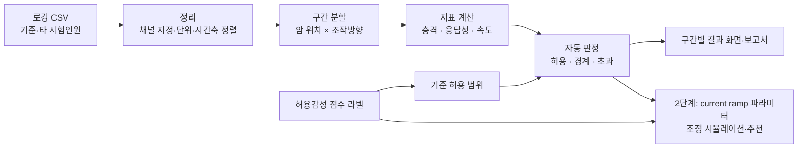

# 로더 암 Current Ramp Calibration 프로그램 — 프로젝트 기획서

| 항목 | 내용 |
|---|---|
| 리포 | data09-09 |
| 제출자 | 이영우 |
| 직무·소속 | 휠로더 시험 담당 (데이터 취득, 파라미터 튜닝 및 데이터 분석, 성능 개발) |
| 과정 | 현장 데이터 디지털화 전문가과정 1차수 |
| 작성일 | 2026-09-28 |
| 문서 상태 | 초안 v0.1 — 수강생 제출 자료 기반 |

> 이 기획서는 패들릿 게시물 본문만으로 작성했습니다. 첨부 docx(`01_______Current_Ramp_Calibration_________.docx`)는 **DRM 암호화 파일**(파일 머리글 `HHIDRMC`)이라 열 수 없었습니다. 첨부 내용이 반영되지 않았으므로 10절의 확인 사항을 먼저 풀어야 합니다.

---

## 1. 추진 배경과 현안

제출자가 적은 현안은 두 가지입니다.

1. **감성 기준의 불일치** — 파라미터 튜닝 시 장비마다 시험자별로 느끼는 감성(작업장치/조향의 속도, 충격, 응답성 등의 프로파일)이 달라, 같은 시리즈인데도 모델별로 일관된 컨셉을 유지하기 어렵습니다.
2. **반복 입력의 비효율** — 파라미터 값을 일일이 입력하고 작동해 보는 방식을 반복해야 해서 업무 효율이 떨어집니다.

즉, "좋은 느낌"의 기준이 사람마다 달라 모델 간 일관성이 흔들리고, 그 기준을 맞추는 과정이 시행착오 반복이라는 문제입니다. 제출자는 이를 **베테랑(기준) 시험인원의 감성 기준을 데이터로 고정**해 풀고자 합니다.

## 2. 목표

### 최종 목표

베테랑 운전자 감성 기준을 기반으로 **암 위치/조작방향 별 충격·응답성을 자동 판정**하고, **구간별 current ramp 파라미터를 시각적으로 조정·추천**할 수 있는 **오프라인 Calibration 프로그램**을 만듭니다. (제출자 기대산출물 그대로)

### 1차 개발 목표

- 기준 시험인원과 타 시험인원의 로깅 CSV를 불러와 **같은 구간(암 위치·조작방향)끼리 겹쳐 비교**합니다.
- 구간별로 **충격·응답성 지표를 계산**하고, 기준 시험인원 데이터에서 얻은 허용 범위와 비교해 **허용/경계/초과로 자동 판정**합니다.
- 판정 결과를 구간×지표 표와 그래프로 보여 주고 결과를 파일로 내보냅니다.
- 파라미터 추천(역산)은 1단계에서 하지 않고, 라벨 데이터 구조를 확인한 뒤 2단계에서 합니다.

## 3. 보유 데이터

| 데이터 | 형태 | 규모·주기 | 비고(민감도 등) |
|---|---|---|---|
| 기준 시험인원 로깅데이터 | CSV | 미확인 | 베테랑 운전자의 시험 로그. 채널(신호) 이름·샘플링 주기 미확인 |
| 타 시험인원 로깅데이터 | CSV | 미확인 | 비교 대상 로그. 기준 로그와 같은 채널 구성인지 미확인 |
| 허용감성 점수 라벨 파라미터 | 형태 미확인 (가정: 표 형식) | 미확인 | 기준 시험인원이 파라미터 조합별로 매긴 허용감성 점수. 점수 척도·파라미터 항목 미확인 |
| 첨부 docx | DRM 암호화 | — | 열람 불가. 내용 확인 필요 |

> 장비 제어 파라미터와 시험 로그는 개발 기밀로 다뤄야 합니다(가정). 그래서 "오프라인" 프로그램이라는 제출자 요구가 중요합니다.

## 4. 해결 방안 개요

- **수집**: 이미 취득 중인 시험 로그 CSV를 그대로 씁니다. 새로 계측할 것은 없습니다.
- **정리**: CSV마다 어느 열이 시간·암 위치·조작 입력(레버/조이스틱)·밸브 전류·실린더 압력·속도인지 지정합니다(실제 채널명은 확인 필요).
- **분석**: 암 위치 구간과 조작방향(올림/내림 등, 가정)별로 잘라 충격·응답성 지표를 계산합니다.
- **판정**: 기준 시험인원 데이터와 허용감성 점수에서 "허용 범위"를 만들고 비교합니다.
- **추천(2단계)**: 라벨 데이터(파라미터 → 점수)의 관계를 학습해 구간별 ramp 값을 제안합니다.

## 5. 주요 기능

| 기능 | 설명 | 우선순위 |
|---|---|---|
| 로그 CSV 불러오기 | 여러 CSV를 드래그해 올리고, 파일마다 시험인원(기준/타)·장비 모델 태그 지정 | MVP |
| 채널 매핑 | 시간·암 위치·조작 입력·밸브 전류 등 열을 사용자가 지정, 매핑을 저장해 재사용 | MVP |
| 구간 분할 | 암 위치 구간 경계와 조작방향 기준을 설정해 동작 구간 자동 분리 | MVP |
| 지표 계산 | 구간별 충격(가정: 가속도·압력 피크, 변화율 최대값), 응답성(가정: 입력 시작 → 동작 시작 지연, 목표 도달 시간), 속도 | MVP |
| 겹쳐 보기 그래프 | 같은 구간의 기준 vs 타 시험인원 시계열을 한 그래프에 겹쳐 표시 | MVP |
| 자동 판정표 | 구간 × 지표 표에 허용/경계/초과 색 표시, 기준 대비 편차 | MVP |
| 결과 내보내기 | 판정표 CSV/Excel, 그래프 이미지 | MVP |
| 허용 범위 편집 | 판정 경계값을 화면에서 조정(베테랑 감성 기준 값 고정용) | MVP |
| 파라미터 조정 시뮬레이션 | 구간별 current ramp(가정: 전류 상승/하강 기울기·시간) 곡선을 드래그로 조정해 보기 | 확장 |
| 파라미터 추천 | 허용감성 점수 라벨로 파라미터 → 점수 관계를 학습해 구간별 추천값 제시 | 확장 |
| 모델 간 컨셉 일관성 비교 | 같은 시리즈 여러 모델의 지표 분포를 나란히 비교 | 확장 |
| 튜닝 노하우 질의 | 시험 기준·튜닝 요령 문서를 RAG로 질의 (과정 DAY4) | 확장 |

## 6. 기대 산출물

- 오프라인에서 도는 로그 비교·자동 판정 도구 (1차)
- 구간 정의(암 위치 × 조작방향)와 충격·응답성 지표 정의서 — 베테랑 감성 기준을 숫자로 옮긴 문서
- 모델별 판정 보고서(판정표 + 겹쳐 보기 그래프)
- (2단계) 구간별 current ramp 조정·추천 화면

## 7. 기술 구성

| 과정 도구 | 적용 |
|---|---|
| DAY1 암묵지 자산화 | 베테랑이 "좋다/나쁘다"를 느끼는 순간을 구간·지표로 쪼개 기록 — 이 과제의 핵심 |
| DAY2 코랩(Python) | 로그 CSV 정리, 지표 계산식 검증, 허용감성 점수와 지표의 관계 확인 |
| DAY3 멀티모달 | (선택) 시험 중 음성 메모를 텍스트화해 로그 구간에 연결 |
| DAY4 RAG | (확장) 튜닝 기준·이력 문서 질의 |
| DAY5 Make | 해당 적음 — 오프라인 요구와 맞지 않음 |
| 생성형 AI | 판정 결과를 튜닝 메모 문장으로 요약(선택) |

**개발 형태 (가정)**

- **설치 없이 브라우저에서 도는 단일 HTML 도구**로 만듭니다. 파일은 브라우저 안에서만 읽고 네트워크로 보내지 않으므로 "오프라인" 요구를 충족합니다. 인터넷이 끊긴 PC에서도 파일 하나를 열면 동작하도록 라이브러리를 파일 안에 포함합니다.
- 로그가 매우 크면(수십만 행 이상, 가정) 브라우저가 느려질 수 있습니다. 그때는 같은 계산 로직을 Python 스크립트(코랩 또는 로컬)로 제공합니다.
- 추천 모델(2단계)은 라벨 데이터 규모에 따라 단순 회귀·최근접 사례 검색부터 시작합니다(가정).

## 8. 개발 단계

### 1단계 — 지금 바로 개발 가능한 부분

샘플 로그가 아직 없으므로, **채널 이름에 기대지 않는 범용 구조**로 먼저 만듭니다.

1. CSV 불러오기 + 채널 매핑 화면 (열 이름을 사용자가 고름)
2. 시간축 정렬과 구간 분할(암 위치 경계값·조작방향 기준을 입력받음)
3. 충격·응답성·속도 지표 계산 — 계산식은 설정으로 바꿀 수 있게 둡니다
4. 기준 vs 타 시험인원 겹쳐 보기 그래프
5. 허용 범위 입력 → 구간 × 지표 자동 판정표 → CSV/Excel 내보내기
6. 시연은 **합성한 가상 로그**(가정)로 하고, 실제 로그를 받으면 지표 정의를 맞춥니다.

### 2단계

- 실제 로그와 허용감성 점수 라벨로 지표 정의·허용 범위를 확정합니다(제출자와 함께 검증).
- 라벨 데이터로 파라미터 → 감성 점수 관계를 학습해 **구간별 current ramp 추천값**을 냅니다.
- ramp 곡선을 화면에서 조정해 보는 시각 도구를 붙입니다.

### 3단계

- 같은 시리즈 여러 모델의 지표를 한 화면에서 비교해 **모델 간 컨셉 일관성**을 관리합니다.
- 튜닝 이력(파라미터 → 결과 → 점수)을 쌓아 추천 품질을 높이고, 튜닝 요령 문서를 RAG로 묶습니다.

## 9. 기대 효과

- 시험자마다 다르던 감성 판단을 **베테랑 기준의 숫자**로 맞춰, 같은 시리즈 모델 간 튜닝 컨셉을 일관되게 유지합니다.
- 파라미터를 입력하고 작동해 보는 반복을, 로그 비교와 추천값으로 줄여 튜닝 업무 효율을 높입니다.
- 베테랑의 감성 기준이 개인 경험에서 조직의 자산(지표 정의서·허용 범위)으로 남습니다.
- 제출 자료에 정량 목표 수치는 없습니다.

## 10. 확인 필요 사항

1. **첨부 docx가 DRM 암호화되어 열리지 않았습니다.** 보안 해제본 또는 본문을 PDF/텍스트로 다시 받을 수 있는지 확인이 필요합니다. (사내 반출 규정상 불가하면 핵심 내용만 요약해 주셔도 됩니다.)
2. 로깅 CSV 샘플 1~2건(기준 시험인원 1건, 타 시험인원 1건) — 민감하면 채널 이름과 단위, 몇 줄만이라도.
3. 로그 채널 구성: 시간, 암 위치(각도/실린더 변위?), 조작 입력, 밸브 전류, 압력, 가속도 중 무엇이 기록됩니까? 샘플링 주기는?
4. "충격"과 "응답성"을 현재 어떤 값으로 판단하십니까? (예: 정지 시 압력 피크, 입력 후 동작까지 지연) — 지표 정의의 출발점입니다.
5. 암 위치 구간은 몇 개로 나눕니까? 조작방향은 올림/내림 외에 더 있습니까(틸트 등)?
6. "허용감성 점수가 라벨링된 파라미터"의 형식 — 점수 척도(예: 1~5점?), 한 행에 어떤 파라미터가 들어 있는지, 몇 건인지.
7. current ramp 파라미터의 구조 — 구간별 상승/하강 시간·기울기 등 항목과 값 범위.
8. 조향도 같은 방식으로 다룰 계획입니까, 1차는 로더 암만입니까?
9. "오프라인"의 뜻 — 인터넷 없는 PC에서 동작해야 하는지, 장비 컨트롤러와 연결되지 않는 분석 전용이라는 뜻인지.

## 부록. 제출 원문 요약

| 출처 | 파일/게시물 | 내용 |
|---|---|---|
| 패들릿 게시물 1 (2026-09-18 04:41) | 「로더 암 current ramp calibration 프로그램」 | 직무·현안 2건·보유데이터(CSV 로깅데이터, 허용감성 점수 라벨 파라미터)·기대산출물 |
| 첨부 01 | `att/01_______Current_Ramp_Calibration_________.docx` | **열람 불가 — DRM 암호화(머리글 `HHIDRMC`)**. 텍스트 추출 실패(`.docx.txt`에 "Package not found" 오류만 기록) |
